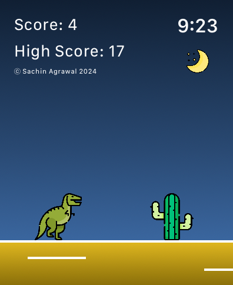

# Dino Game

## About
Play a clone of the iconic Google Chrome no-internet [Dinosaur Game](chrome://dino) [^1] on your wrist. I looked all over for something like this, and I couldn't find anything remotely close in quality, so I decided to make this using pure SwiftUI for fun. If you like this game or enjoyed playing it, I would appreciate if you starred it or even shared it with your friends. I also don't expect to work on this too much more, as I am quite satisfied with the end result.

## Inspiration
I initially recreated the [Dino Game for Fitbit](https://gallery.fitbit.com/details/eef441ed-b2b5-49ec-b1c6-fbfa8177453f) smartwatches, namely the original Versas, a few years ago before I started wearing an Apple Watch. (In fact, you can see some of my other open-source Fitbit apps on my Github, so go check those out.) However, that app was quite buggy in terms of collision detection and the dinosaur sprite. It also became obsolete once I got my Apple Watch since it no longer had any use for me. That is the inspiration for the UI, and both are almost identical, down to the same sprite images and haptics. This does have nicer animations and the implementation is slightly better, though.

## Acknowledgments
Most of this code was written by ChatGPT. Some of the logic for collision detection and element formatting I needed to fix, but I basically told it to start with a very basic implementation with rectangles to represent the dinosaur and cactus, and slowly had it add more features.

## Usage
Simply tap anywhere on screen to make the dinosaur jump over different types of cacti and the occasional pterodactyl as the game gets progressively faster. Each time you successfully do so, your score will increase. Once you do collide with an obstacle, hit the restart button that will appear to play again. Much like the original game, the pterodactyls do not start spawning immediately, and they can also spawn at different heights, so be sure to not jump into them when they are flying higher! 

## Installation
1. Clone this repository or download it as a zip folder and uncompress it.
2. Open up the `.xcodeproj` file, which should automatically launch Xcode.
3. You might need to change the signing of the app from the current one.
4. Click the `Run` button near the top left of Xcode to build and install.

#### Prerequisites
Hopefully this goes without saying, but you need Xcode, which is only available on Macs.

#### Notes
You can run this app on the Xcode simulator or connect a physical device.  
The watch must be paired with a device running iOS 13.0 or newer. 

## SDKs
* [SwiftUI](https://developer.apple.com/xcode/swiftui/) - Helps you build great-looking apps across all Apple platforms.
* [WatchKit](https://developer.apple.com/documentation/watchkit/) - The framework provides infrastructure for creating watchOS apps.

## Bugs
If you find one, feel free to open up a new issue or even better, create a pull request fixing it. But then again, this game is extremely simple, so I don't expect for there to be any.

## Contributors
Sachin Agrawal: I'm a self-taught programmer who knows many languages and I'm into app, game, and web development. For more information, check out my website or Github profile. If you would like to contact me, my email is [github@sachin.email](mailto:github@sachin.email).

## License
This package is licensed under the [MIT License](LICENSE.txt).

[^1]: Only works using Chrome as your browser.
